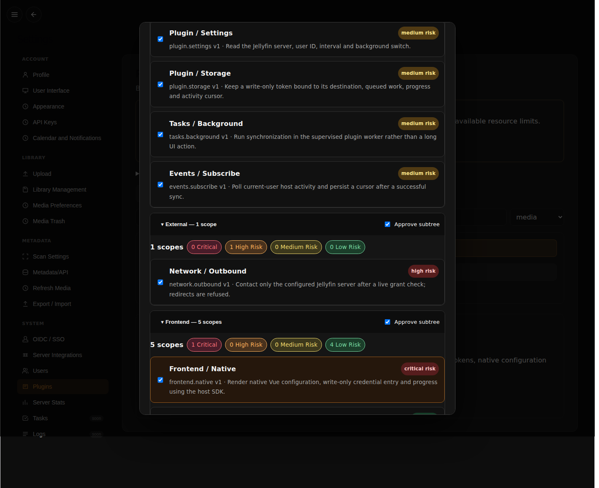
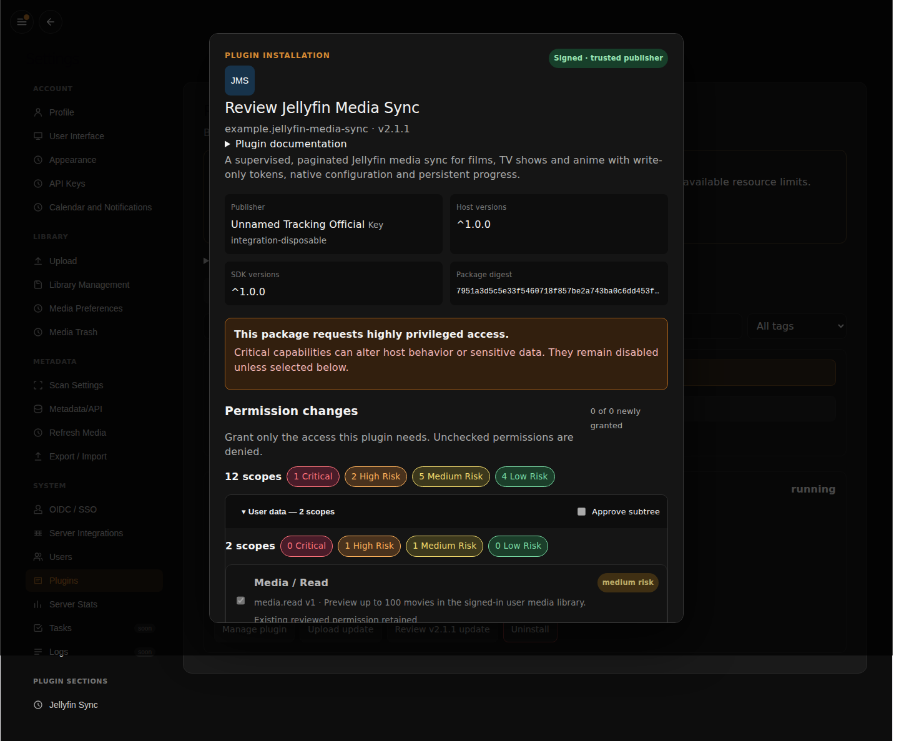
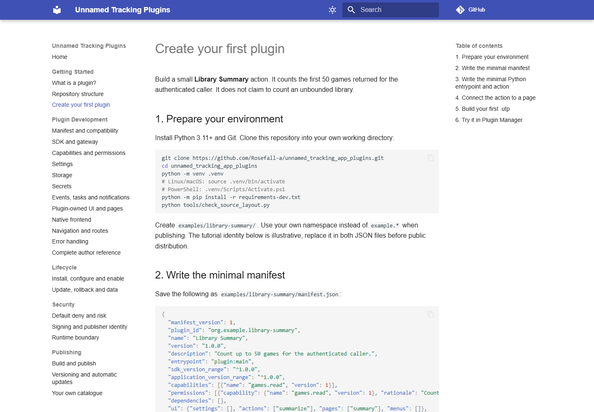

# Screenshots and provenance

These are real browser captures. A component fixture is labeled as such; it is
not evidence of authenticated installation or permission enforcement.

| Asset | What was captured | Provenance |
| --- | --- | --- |
| `scoped-document-viewer.png` | Actual sandboxed PDF reader | Existing document browser validation, recorded in the dated report |
| `scoped-document-reader-office.png` | Actual direct Office reading preview | Existing reader browser validation, recorded in the dated report |
| `session-manager-admin.png` | Actual native admin component with disposable data | Existing local Vue harness; not an authenticated host screenshot |
| `developer-wiki.png` | Built Material/MkDocs first-plugin tutorial | Current local strict build, real Chromium capture |
| `permission-review.png` | Actual install consent dialog, scrolled to permission groups | Successful real-host CI run linked below; disposable publisher/database |
| `jellyfin-native-ui.png` | Actual host plugin Settings/UI before configuration | Same CI run; validation error reflects the intentionally empty server setting |
| `update-review.png` | Actual package/publisher/version and update permission review | Same CI run; old package remains running behind the dialog |

The three authenticated host captures come from successful
[Plugin Manager integration run 36992317132](https://github.com/Rosefall-a/unnamed_tracking_app_plugins/actions/runs/36992317132)
on 2 October 2026, plugin revision `56040e890d357f145fd307f60361976f23fd4233`.
The workflow checks out the actual host `plugin-manager` branch, builds its frontend,
and drives its real authenticated installer against disposable PostgreSQL/runtime
state. The test signing key is `integration-disposable`, not a production identity.
Artifact `11219839128` has ZIP SHA-256
`39a02afbf893661f727ebe043dbc79f9a23c39d64515e5dab0f14ba7b05b8d54`;
the imported PNG bytes are unchanged. The host branch was floating in that run,
so these captures do not claim a separately pinned host revision.

## Capture live Plugin Manager workflows

The existing host acceptance runs the **real built host frontend** against its
disposable PostgreSQL/HTTP/runtime deployment. Its Playwright script saves
`permission-review.png`, `jellyfin-native-ui.png` (settings/plugin UI) and
`update-review.png` (release/permission details) to the work directory. The CI job
uploads them as `plugin-manager-integration-evidence`, including failure captures
and logs. Download successful captures, verify they match the reviewed host build,
then add them here with revision/date/workflow provenance.

For a reproducible local run follow [testing](../../testing/index.md), including
the host prerequisites, and pass `--browser`. Do not construct a lookalike
Plugin Manager UI or label unit fixture output as an installation screenshot.
The captures above were imported from a successful job and visually inspected.
They remain dated evidence; refresh them from a successful run when the host UI changes.

## Jellyfin version 3

The administrator settings, user mapping, explicit library mapping, sync status and Watch Now screenshots in [Jellyfin Media Sync](../../examples/jellyfin.md) were captured with the actual signed package installed in the real host/runtime and PostgreSQL, against the disposable Jellyfin HTTP fixture. `tools/capture_jellyfin.mjs` logs in to the actual frontend and asserts the exact media destination before capture.
