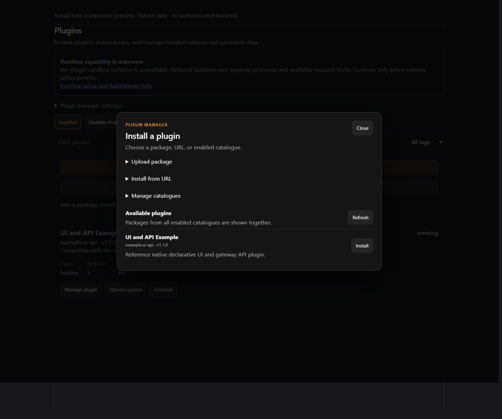
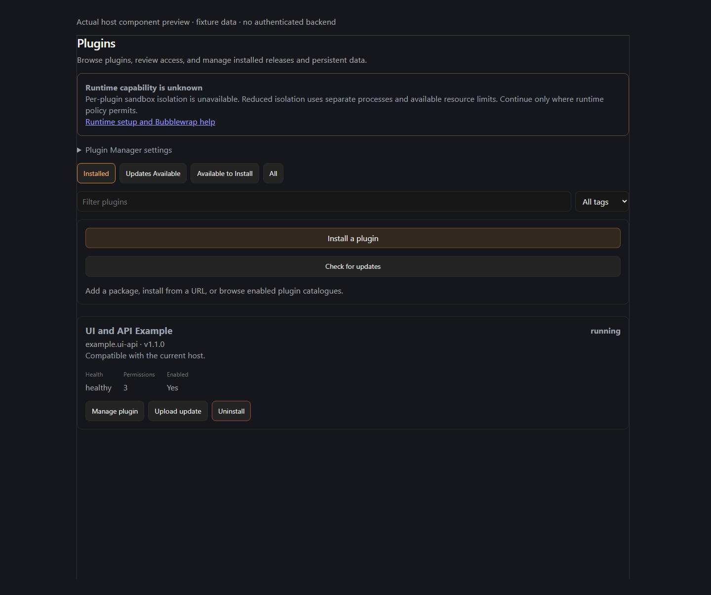
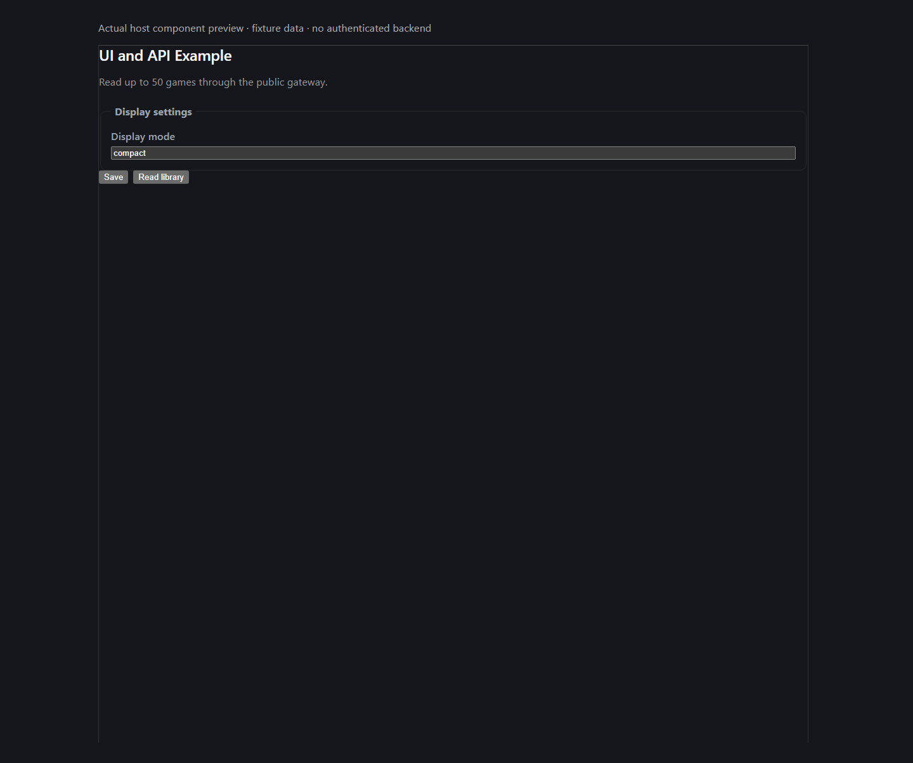
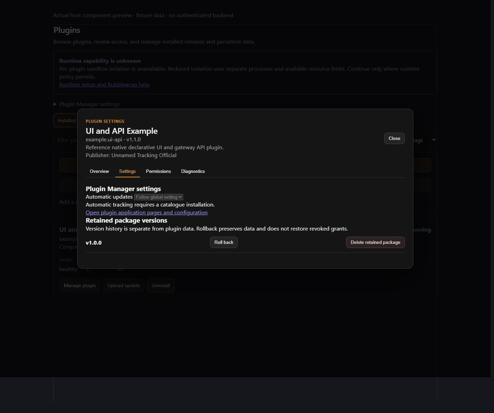

# Screenshots and provenance

These are real browser captures. A component fixture is labeled as such; it is
not evidence of authenticated installation or permission enforcement.

| Asset | What was captured | Provenance |
| --- | --- | --- |
| `scoped-document-viewer.png` | Actual sandboxed PDF reader | Existing document browser validation, recorded in the dated report |
| `scoped-document-reader-office.png` | Actual direct Office reading preview | Existing reader browser validation, recorded in the dated report |
| `session-manager-admin.png` | Actual native admin component with disposable data | Existing local Vue harness; not an authenticated host screenshot |
| `developer-wiki.png` | Built Material/MkDocs first-plugin tutorial | Current local strict build, real Chromium capture |
| `permission-review.png` | Actual install consent dialog, scrolled to permission groups | Successful real-host CI run linked below; disposable publisher/database |
| `jellyfin-native-ui.png` | Actual host plugin Settings/UI before configuration | Same CI run; validation error reflects the intentionally empty server setting |
| `update-review.png` | Actual package/publisher/version and update permission review | Same CI run; old package remains running behind the dialog |
| `plugin-install-component.png` | Actual installer source chooser | Real Vue source; fixture API; no installation executed |
| `installed-plugin-component.png` | Actual installed-plugin card | Real Vue source; fixture running state/grants |
| `plugin-settings-component.png` | Actual UI/API form and action | Real `PluginUiHost` and maintained document; no save/action executed |
| `lifecycle-controls-component.png` | Actual stop/disable/reinstall/purge/uninstall controls | Real manager dialog; no lifecycle operation executed |
| `retained-versions-component.png` | Actual rollback/retained-package controls | Real manager dialog with fixture history |

The three authenticated host captures come from successful
[Plugin Manager integration run 36992317132](https://github.com/Rosefall-a/unnamed_tracking_app_plugins/actions/runs/36992317132)
on 2 October 2026, plugin revision `56040e890d357f145fd307f60361976f23fd4233`.
The workflow checks out the actual host `plugin-manager` branch, builds its frontend,
and drives its real authenticated installer against disposable PostgreSQL/runtime
state. The test signing key is `integration-disposable`, not a production identity.
Artifact `11219839128` has ZIP SHA-256
`39a02afbf893661f727ebe043dbc79f9a23c39d64515e5dab0f14ba7b05b8d54`;
the imported PNG bytes are unchanged. The host branch was floating in that run,
so these captures do not claim a separately pinned host revision.

## Installer, installed state and lifecycle controls

The views below were captured on 2 October 2026 from host revision
`5af8f17dcdda41b8242953f46ef87d46febb1f03`. They compile and render actual
`PluginManagerSection`, `PluginSettingsDialog` and `PluginUiHost` Vue source.
The UI/catalogue inputs come from UI/API v1.1.0 at plugin revision
`82b5ee01d81de39f30c94e152ac6e11480c3816c`. API status, grants and retained history
are fixture replies. These document controls/layout, **not** authenticated
installation, isolation or lifecycle enforcement.

The [capture manifest](host-components.json) records timestamp, revisions, purpose
and SHA-256 for each unchanged PNG. The documentation checker verifies the bytes.



Choose upload, URL or catalogue. This capture stops before package review.



The installed card shows version, health, permission count and management entry.
Its running state is seeded for this preview.



Display mode and Read library come from the maintained declarative document.
No setting is saved or action executed. The authenticated Jellyfin capture below
demonstrates a separate write-only token form.


Stop/disable, retaining reinstall, purge and uninstall are distinct controls.
No lifecycle operation is clicked during capture.



Rollback and deletion of a retained package are separate from data restoration.
The retained version here is a fixture rather than an actual installation history.

## Authenticated host and existing plugin captures


## Capture live Plugin Manager workflows

The existing host acceptance runs the **real built host frontend** against its
disposable PostgreSQL/HTTP/runtime deployment. Its Playwright script saves
`permission-review.png`, `jellyfin-native-ui.png` (settings/plugin UI) and
`update-review.png` (release/permission details) to the work directory. The CI job
uploads them as `plugin-manager-integration-evidence`, including failure captures
and logs. Download successful captures, verify they match the reviewed host build,
then add them here with revision/date/workflow provenance.

For a reproducible local run follow [testing](../../testing/index.md), including
the host prerequisites, and pass `--browser`. Do not construct a lookalike
Plugin Manager UI or label unit fixture output as an installation screenshot.
The captures above were imported from a successful job and visually inspected.
They remain dated evidence; refresh them from a successful run when the host UI changes.

To reproduce component previews on Windows or Linux, install this repository's
locked browser dependencies and Chromium plus the host's frontend dependencies:

```sh
node tools/capture_host_components.mjs .validation/host .validation/host-component-captures
```

Review and copy PNGs and the generated manifest together when refreshing docs.
Keep authenticated captures and component fixture captures separately named.
