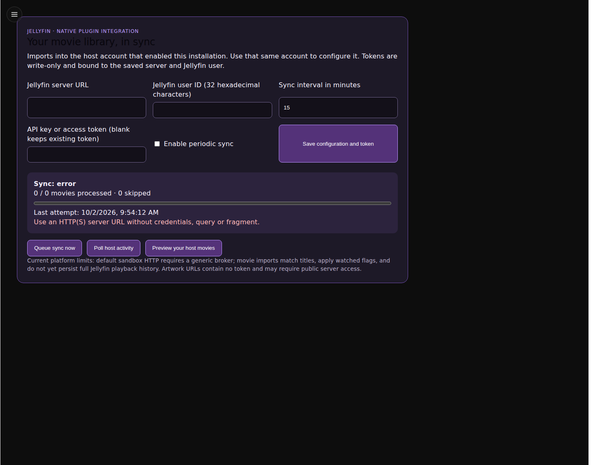

# Settings

## Goal and prerequisites

Add a saved display preference to a complete plugin. Start with Library Summary
or UI/API, obtain `plugin.settings` v1 approval, and use the section shape below.

Start from UI/API to add a small generated settings form. Settings belong to the
installation; ordinary values are separate from secrets and plugin-owned
persistent state.

1. Declare `plugin.settings` v1 and its permission.
2. Add a settings section ID to `manifest.ui.settings`.
3. Define a section in `ui.json` with `id`, `title`, and `fields`:

```json
{"id": "display", "title": "Display", "fields": [{"id": "display_mode", "label": "Display mode", "type": "text", "default": "compact"}]}
```

4. Reference the section ID in a declared page's `settings` list.
5. Read it using the gateway and handle absent defaults:

```python
mode = request("settings.get", "plugin.settings", {"key": "display_mode"}).get("value") or "compact"
```

The host owns saving, form validation and approval. Putting individual fields
directly into top-level `settings[]` is invalid. A plugin's configuration form is
distinct from contributing a new host Settings section; that uses
`frontend.settings` and, when native components are loaded, `frontend.native`.

Test empty values, invalid settings, restart and update preservation. Keep tokens
out of these ordinary fields; use [secrets](secrets.md).



The empty-server validation state is intentional; see [capture provenance](../assets/screenshots/index.md).

## Minimal action

<!-- recipe: settings -->
```python
from sdk.plugin_protocol import request

def run(values: dict) -> dict:
    value = request("settings.get", "plugin.settings", {"key": "display_mode"}).get("value")
    return {"display_mode": "compact" if value is None else value}
```

Handle absence explicitly: `or default` also replaces valid empty strings, zero
and false. Use declared field validation when these values should be invalid.

## Test command

```sh
python -m pytest tests/test_feature_tutorials.py -k settings
python -m pytest tests/test_examples.py
```

## Expected result

The action defaults only an absent value and preserves a saved value. In the
host, save and reopen the form; restart/update/reinstall preserve configuration
as checked by [lifecycle conformance](../testing/lifecycle.md).

## Common mistakes

Putting fields directly in top-level `settings[]`; mismatched section/page IDs;
replacing false/zero with defaults; storing tokens in ordinary fields; assuming
a plugin form automatically creates a host Settings section.
