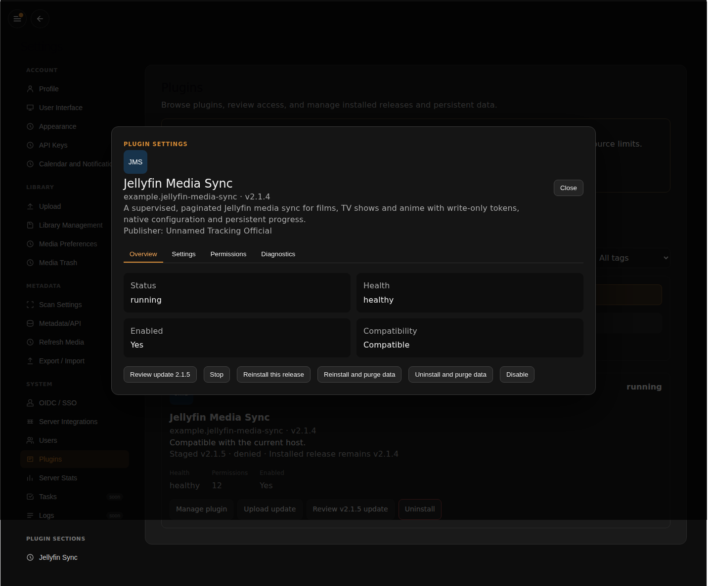

# Every lifecycle operation

Use a disposable development installation for destructive checks. A package's
distribution history is separate from the host installation's retained rollback
packages and live data.

| Operation | What happens | What to verify |
| --- | --- | --- |
| Install | Validate package, review identity/compatibility/permissions, commit installation | Pending permission transactions cannot execute |
| Enable | Activate an approved installation and its eligible contributions | Worker healthy; granted UI visible |
| Start | Launch the Python entrypoint and wait for readiness | `lifecycle.ready`, worker remains alive |
| Stop | Terminate running work | No more operations; durable state remains |
| Disable | Stop active execution and contributions | Data/settings remain; pages/actions unavailable |
| Update | Stage a verified candidate; consent to new authority; health-check activation | Old release remains active while new scope awaits approval |
| Rollback | Activate the retained predecessor package | Same installation identity and data; earlier code can read newer data |
| Reinstall | Install the same retained release with explicit retaining-data choice | Settings and storage remain readable |
| Purge | Explicitly clear installation data/configuration and reset approvals through host flow | Previously saved state/secrets unavailable; reconfigure before work |
| Uninstall | Remove package/history and owned runtime/host records | Nonempty data and retained packages are gone |

The UI labels and available operations depend on the host build and installation
state. Never implement these by deleting host files from plugin code. Use Plugin
Manager's supported controls and confirmation flow.

For [updates and recovery](updates.md), save a sentinel before the operation and
verify it afterward. After testing purge, save a fresh sentinel before uninstall;
otherwise the uninstall test proves only that an empty store remains empty.
The [lifecycle conformance matrix](../testing/lifecycle.md) identifies which real
host tests establish each behavior.

The [capture record](../assets/screenshots/index.md) documents the actual host,
disposable installation and permission-denial state behind these controls.
