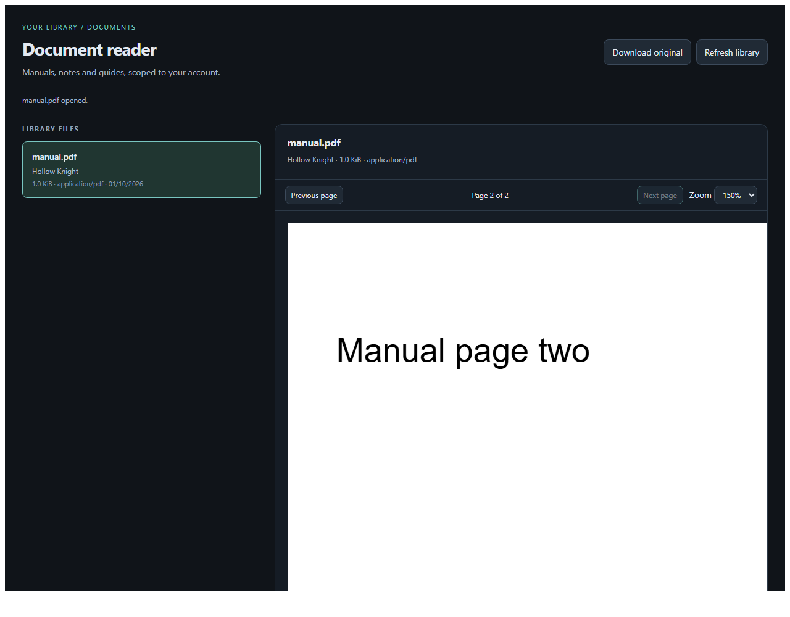
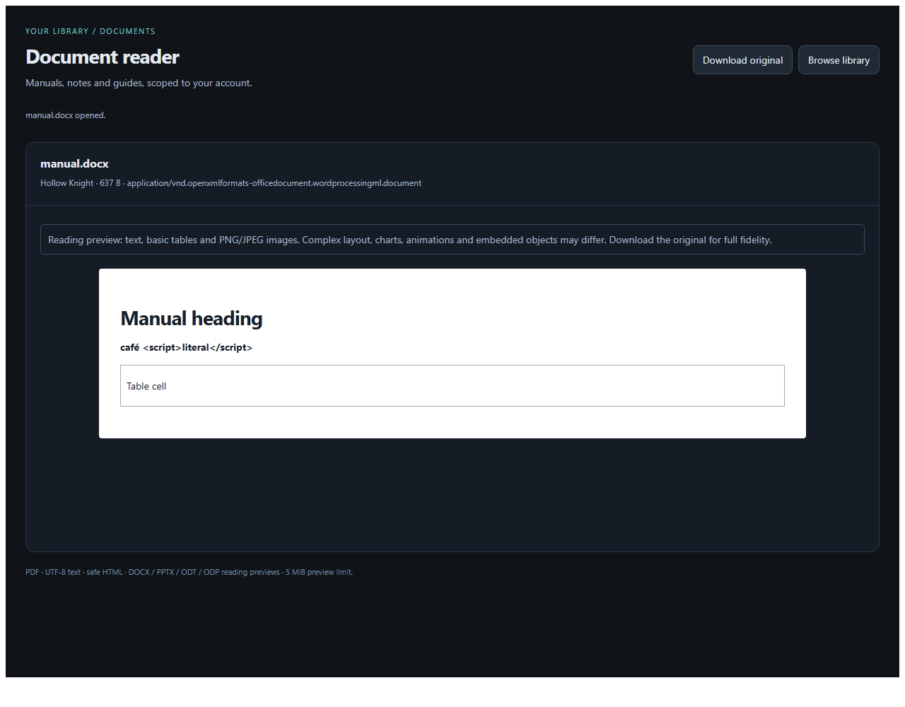

# Scoped Document Viewer

The official plugin implementation of [application PR #241](https://github.com/Rosefall-a/unnamed_tracking_app/pull/241), inspected at `a9b7d3102c1efec08a5bf11a919c6d2204376ebc`. The PR's current code supports sanitized HTML/XHTML, despite its older summary describing only PDF/text.

Version **1.7.0** adds configurable preview limits to the game Docs reader. The optional library remains available through Browse library. It provides a plugin-owned reader with game/file metadata, paginated listing, loading and explicit error states, PDF pages and zoom, literal UTF-8 text, and sanitized HTML with a source toggle. It reuses the host's `GameFileItem` rows and `games/<folder>/docs` storage through public document DTOs and opaque IDs. Upload files in the host game's Docs tab; the plugin does not create a separate document store.

## Permissions

| Permission | Purpose |
| --- | --- |
| `documents.read` v1 | List/read documents belonging to the current caller's games. |
| `backend.routes.plugin` v1 | Publish authenticated JSON handlers under this plugin's namespace. |
| `frontend.context.documents` v1 | Register the reader for game Docs entries; the host opens an owned document ID in a new tab. |

Native configuration uses explicitly reviewed `frontend.native`, `frontend.settings` and `frontend.navigation.settings` grants. Document rendering retains its opaque sandboxed iframe. No full API, host route, network, filesystem, credential, or persistent-storage permission is requested. The viewer also requests `plugin.settings` so its preview-size preference can be persisted by the plugin runtime. The backend imports only the public SDK. Updates require normal host consent for the document-context grant. There is no mandatory Documents sidebar section.

## Security model

The host checks the current installation, lifecycle, active user and live grants on each action, route and document chunk. Document queries join `GameFileItem` to the caller's active games, exclude trashed items/non-document kinds, and do not expose another user's IDs/content. Another user's ID and a nonexistent ID both produce a missing-document result.

Paths remain host-owned. Stored names containing separators, encoded separators, dot traversal, NUL or Windows drive syntax are rejected. Resolved paths and game folders must stay within the caller's game/document root; escaping symlinks are rejected. The host retains a 5 MiB compatibility default but accepts an explicit preview ceiling from this plugin. The setting defaults to `0` (unlimited), and the plugin sends that value on every chunk read. The host still validates ownership, format, traversal and the live capability grant before returning each 24 KiB base64 chunk. Every continuation repeats authorization and content validation; SHA-256 detects replacement or mixed chunks. The frontend also validates IDs, MIME/format, byte counts, offsets, UTF-8 and final digest. No sandbox flags were relaxed. The fixed 5 MiB Plugin API preview ceiling is now configurable for this plugin, including an unlimited (`0`) setting.

The host serves verified package CSS and classic scripts in the authenticated entry response (`frontend.inline_assets: true`), authorizing only the bundled scripts with a fresh CSP nonce. Opaque iframe subresource requests do not need login cookies; no asset endpoint is made public and no same-origin permission is granted. The custom frontend runs under the host's `sandbox="allow-scripts"` and CSP. It gets no cookies or host DOM access. Requests use the correlated parent bridge, with cancellation and timeouts. User data responses carry `nosniff` and `private, no-store`; document bytes are never served as an uploaded HTML page. PDF.js, DOMPurify and the SHA-256 fallback are packaged offline, pinned and integrity checked; no CDN/runtime download is used.

PDF.js renders canvas pages with evaluation, XFA, form/annotation interaction, external resource fetching and font downloads disabled. HTML uses DOMPurify's HTML profile and PR #241's forbidden tags/attributes, with additional restrictions on navigation/ping. SVG/MathML, scripts, images, forms, frames, styles and active URLs are removed. All remaining links are inert. Plain text always uses `textContent`.

## Supported documents

- PDF identified by `%PDF-`, including PDFs with an incorrect extension. Malformed/encrypted PDFs produce a renderer error.
- Strict UTF-8: `.cfg`, `.conf`, `.csv`, `.ini`, `.json`, `.log`, `.md`, `.nfo`, `.properties`, `.toml`, `.txt`, `.xml`, `.yaml`, `.yml`; the PR's conservative text MIME allowlist also applies. Existing platform `.markdown` and `.rst` support remains.
- `.html`, `.htm`, `.xhtml`: transported as `text/plain` with `format: html`, then sanitized. A source view shows literal text.
- `.docx`, `.pptx`, `.odt`, `.odp`: local reading previews show text, basic tables and embedded PNG/JPEG images. Slides retain presentation order. Office styles, charts, animations, equations and complex layout are not reproduced. The original remains downloadable.
- Office containers are limited to 1,024 entries, 20 MiB expanded total, 2 MiB per XML part, 5 MiB per other part and 100:1 compression (a 1 KiB floor allows tiny compressed parts). XML DTDs/entities, macros, ActiveX, embedded objects, encryption and escaping/duplicate archive paths are rejected. XML trees are capped at 50,000 nodes; presentations at 500 slides. External links/resources are inert; SVG images and unknown raster types are not rendered.
- Empty text is supported. Binary controls and invalid UTF-8 are rejected. SVG, legacy `.doc`/`.ppt`, macro-enabled Office, arbitrary archives and other unsupported files remain listed with metadata and fail explicitly when opened.

## Opening and downloading

In a game's **Docs** tab, click a filename to open the registered reader in a new browser tab. The host passes only `document_id` and `game_id` through `plugin.context`; the reader opens that ID directly without fetching the whole library. If no authorized reader is active, the filename retains its normal download behavior. Readers are selected by declared extension and deterministic order. A separate Download link remains on every game document row.

**Download original** in the reader calls `plugin.download-document`. The parent checks the scoped attachment endpoint using authenticated HEAD, then starts the download. GET repeats live authorization and ownership; unsupported/malformed/oversized previews can still be downloaded as inert originals. The download endpoint is `/api/plugins/<plugin-id>/capabilities/documents/<document-id>/download`, uses opaque IDs and safe stored-path resolution, and always sends attachment disposition, octet-stream, nosniff and private/no-store. Downloads stream independently of the 5 MiB preview cap. The sandbox gets neither a raw URL nor cookies and requires no download/native privilege.

## Dedicated plugin API

`GET /api/plugins/example.scoped-document-viewer/documents?limit=32&offset=0` returns a page and `next_offset`. `GET .../documents/<document-id>` returns the first bounded chunk. Continue with `?offset=<next_offset>&content_sha256=<digest>` until `complete` is true. JSON errors retain their `kind`, safe `message` and HTTP status (`400`, `404`, `409`, `413`, `415`, `500`). The host separately enforces `401`/`403` authorization and lifecycle errors.

The UI invokes the equivalent declared actions; it never fetches host data endpoints directly. Neither API accepts caller-supplied storage paths or user IDs.

## Differences and restrictions relative to PR #241

- The viewer's **Maximum preview size (MiB)** setting defaults to `0`, meaning no fixed Plugin API preview ceiling. A positive value applies that many MiB as the host-side preview ceiling. The original download remains independently streamable. Browser memory, PDF.js, Office parsing, and renderer limits can still prevent extremely large files from being practical to display.
- The browser-native PDF iframe cannot reliably load in an opaque sandbox. Bundled PDF.js supplies page/zoom controls. Native print, PDF text search/selection, interactive forms and links are not reproduced. PDF passwords are unsupported.
- File upload compatibility (`file`/`files`), file/media rename and generic downloads added on the PR branch are host management features. The read-only document APIs cannot reproduce them. Use the host's existing Docs management UI; this plugin adds no write privilege or undocumented endpoints.
- Only indexed, active `GameFileItem(kind=doc)` rows are listed. Legacy disk-only files need the host Docs listing/scan to index them. No document editing, indexing, OCR or annotation is provided.
- HTML links are disabled, a stricter navigation policy than the PR's sanitized HTML component.
- Requires the accompanying `plugin-manager` document chunk/pagination contract and reader contribution, inline-asset delivery, scoped download and bridge context/status support, including the optional `max_bytes` document-read field (`0` = unlimited). Version 1.5.0 must not be advertised as compatible with an older host just because both expose API v1.

## Build and verification

```sh
python -m pytest -q
npm ci
npx playwright install --with-deps chromium --only-shell
npm run check
npm test
python tools/build_packages.py
python tools/verify_packages.py dist/*.utp
python tools/validate_packages.py dist/*.utp
```

Browser tests run the actual assets in the host's opaque sandbox/CSP and verify PDF pixels/page controls, sanitization, UTF-8, explicit errors, malformed payloads/documents, integrity and stale responses. They also reproduce the original authenticated sandbox CSS failure, exercise direct game links/downloads, and render actual OOXML/OpenDocument archives. Host tests cover persisted ownership, live grants/revocation, deletion, traversal, limits and transport size. For a direct comparison to the actual PR source:

```sh
python tools/check_document_parity.py --reference /path/to/pr241-checkout --host /path/to/updated-host
```

See the [validation report](../../docs/scoped-document-viewer-validation.md) for recorded results, baseline static-check failures, and environment limitations.

`tools/vendor_document_libraries.py` reproducibly downloads the pinned upstream libraries (PDF.js 5.6.205, DOMPurify 3.4.14, js-sha256 0.11.1, fflate 0.8.3), checks npm SHA-512 archive integrity against `vendor-lock.json`, and records packaged-file SHA-256 hashes and licenses. Classic-script wrappers allow the libraries to run in an opaque origin without module CORS or worker/network privileges. PDF.js uses its in-process worker implementation.

The new checked-in `.utp` is a valid **unsigned local build**, requiring the host's explicit untrusted-package install confirmation. Existing signed releases are preserved. Trusted release signing must use the repository's reviewed publisher workflow; no private key or fabricated signature is included.

Digest verification and secure request correlation also work on HTTP deployments: Web Crypto is used when available, with bundled SHA-256 and `getRandomValues` fallbacks otherwise. Browser tests verify this path. See the [Web Crypto context rules](https://developer.mozilla.org/en-US/docs/Web/API/Window/crypto), [PDF.js API](https://mozilla.github.io/pdf.js/api/) and [native PDF sandbox restriction](https://developer.mozilla.org/en-US/docs/Web/HTML/Reference/Elements/iframe).





## Native configuration

After granting the native and settings permissions, open **Settings → Document
reader** to edit the preview limit, reload configuration or open the browser.
The settings component uses only the public Vue and scoped action/settings SDK.
The document browser's content remains sandboxed and follows the host palette
through the public cosmetic bridge. Without native approval its existing
sandboxed/declarative configuration remains available.
