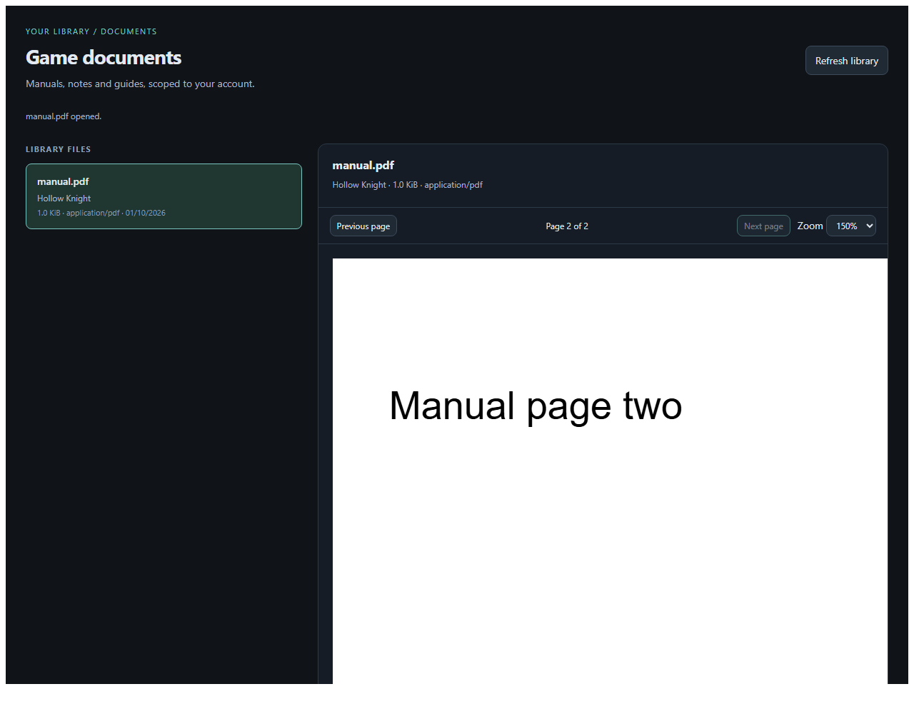

# Scoped Document Viewer

The official plugin implementation of [application PR #241](https://github.com/Rosefall-a/unnamed_tracking_app/pull/241), inspected at `a9b7d3102c1efec08a5bf11a919c6d2204376ebc`. The PR's current code supports sanitized HTML/XHTML, despite its older summary describing only PDF/text.

Version **1.4.0** provides a plugin-owned Documents page with game/file metadata, paginated listing, loading and explicit error states, PDF pages and zoom, literal UTF-8 text, and sanitized HTML with a source toggle. It reuses the host's `GameFileItem` rows and `games/<folder>/docs` storage through public document DTOs and opaque IDs. Upload files in the host game's Docs tab; the plugin does not create a separate document store.

## Permissions

| Permission | Purpose |
| --- | --- |
| `documents.read` v1 | List/read documents belonging to the current caller's games. |
| `backend.routes.plugin` v1 | Publish authenticated JSON handlers under this plugin's namespace. |
| `frontend.navigation.main` v1 | Display the Documents page in main navigation. |

No native frontend, full API, host route, network, filesystem, credential, or persistent-storage permission is requested. The backend imports only the public SDK. Updates require normal host consent for the added navigation grant.

## Security model

The host checks the current installation, lifecycle, active user and live grants on each action, route and document chunk. Document queries join `GameFileItem` to the caller's active games, exclude trashed items/non-document kinds, and do not expose another user's IDs/content. Another user's ID and a nonexistent ID both produce a missing-document result.

Paths remain host-owned. Stored names containing separators, encoded separators, dot traversal, NUL or Windows drive syntax are rejected. Resolved paths and game folders must stay within the caller's game/document root; escaping symlinks are rejected. The host reads at most 5 MiB plus one sentinel byte before returning any content, validates the complete representation, and transports 24 KiB chunks as base64 JSON. Every continuation repeats authorization and content validation; SHA-256 detects replacement or mixed chunks. The frontend also validates IDs, MIME/format, byte counts, offsets, UTF-8 and final digest. No limits or sandbox flags were relaxed.

The custom frontend runs under the host's `sandbox="allow-scripts"` and CSP. It gets no cookies or host DOM access. Requests use the correlated parent bridge, with cancellation and timeouts. User data responses carry `nosniff` and `private, no-store`; document bytes are never served as an uploaded HTML page. PDF.js, DOMPurify and the SHA-256 fallback are packaged offline, pinned and integrity checked; no CDN/runtime download is used.

PDF.js renders canvas pages with evaluation, XFA, form/annotation interaction, external resource fetching and font downloads disabled. HTML uses DOMPurify's HTML profile and PR #241's forbidden tags/attributes, with additional restrictions on navigation/ping. SVG/MathML, scripts, images, forms, frames, styles and active URLs are removed. All remaining links are inert. Plain text always uses `textContent`.

## Supported documents

- PDF identified by `%PDF-`, including PDFs with an incorrect extension. Malformed/encrypted PDFs produce a renderer error.
- Strict UTF-8: `.cfg`, `.conf`, `.csv`, `.ini`, `.json`, `.log`, `.md`, `.nfo`, `.properties`, `.toml`, `.txt`, `.xml`, `.yaml`, `.yml`; the PR's conservative text MIME allowlist also applies. Existing platform `.markdown` and `.rst` support remains.
- `.html`, `.htm`, `.xhtml`: transported as `text/plain` with `format: html`, then sanitized. A source view shows literal text.
- Empty text is supported. Binary controls and invalid UTF-8 are rejected. SVG, office/archive and other unsupported files remain listed with metadata and fail explicitly when opened.

## Dedicated plugin API

`GET /api/plugins/example.scoped-document-viewer/documents?limit=32&offset=0` returns a page and `next_offset`. `GET .../documents/<document-id>` returns the first bounded chunk. Continue with `?offset=<next_offset>&content_sha256=<digest>` until `complete` is true. JSON errors retain their `kind`, safe `message` and HTTP status (`400`, `404`, `409`, `413`, `415`, `500`). The host separately enforces `401`/`403` authorization and lifecycle errors.

The UI invokes the equivalent declared actions; it never fetches host data endpoints directly. Neither API accepts caller-supplied storage paths or user IDs.

## Differences and restrictions relative to PR #241

- **PDFs also have the platform's 5 MiB cap.** PR #241 limits text to 5 MiB but streams PDFs without a viewer size cap. Large PDFs require a future authorized streaming API; this plugin does not bypass the current bounded domain API.
- The browser-native PDF iframe cannot reliably load in an opaque sandbox. Bundled PDF.js supplies page/zoom controls. Native print, download, text search/selection, interactive forms and links are not reproduced. PDF passwords are unsupported.
- File upload compatibility (`file`/`files`), file/media rename and generic downloads added on the PR branch are host management features. The read-only document APIs cannot reproduce them. Use the host's existing Docs management/download UI; this plugin adds no write privilege or undocumented endpoints.
- Only indexed, active `GameFileItem(kind=doc)` rows are listed. Legacy disk-only files need the host Docs listing/scan to index them. No document editing, indexing, OCR or annotation is provided.
- HTML links are disabled, a stricter navigation policy than the PR's sanitized HTML component.
- Requires the accompanying `plugin-manager` document chunk/pagination contract and bridge HTTP status support. Version 1.4.0 must not be advertised as compatible with an older host just because both expose API v1.

## Build and verification

```sh
python -m pytest -q
npm ci
npx playwright install --with-deps chromium --only-shell
npm run check
npm test
python tools/build_packages.py
python tools/verify_packages.py dist/*.utp
python tools/validate_packages.py dist/*.utp
```

Browser tests run the actual assets in the host's opaque sandbox/CSP and verify PDF pixels/page controls, sanitization, UTF-8, explicit errors, malformed payloads/documents, integrity and stale responses. Host tests cover persisted ownership, live grants/revocation, deletion, traversal, limits and transport size. For a direct comparison to the actual PR source:

```sh
python tools/check_document_parity.py --reference /path/to/pr241-checkout --host /path/to/updated-host
```

See the [validation report](../../docs/scoped-document-viewer-validation.md) for recorded results, baseline static-check failures, and environment limitations.

`tools/vendor_document_libraries.py` reproducibly downloads the pinned upstream libraries (PDF.js 5.6.205, DOMPurify 3.4.14, js-sha256 0.11.1), checks npm SHA-512 archive integrity against `vendor-lock.json`, and records packaged-file SHA-256 hashes and licenses. Classic-script wrappers allow the libraries to run in an opaque origin without module CORS or worker/network privileges. PDF.js uses its in-process worker implementation.

The new checked-in `.utp` is a valid **unsigned local build**, requiring the host's explicit untrusted-package install confirmation. Existing signed releases are preserved. Trusted release signing must use the repository's reviewed publisher workflow; no private key or fabricated signature is included.

Digest verification and secure request correlation also work on HTTP deployments: Web Crypto is used when available, with bundled SHA-256 and `getRandomValues` fallbacks otherwise. Browser tests verify this path. See the [Web Crypto context rules](https://developer.mozilla.org/en-US/docs/Web/API/Window/crypto), [PDF.js API](https://mozilla.github.io/pdf.js/api/) and [native PDF sandbox restriction](https://developer.mozilla.org/en-US/docs/Web/HTML/Reference/Elements/iframe).


