# Screenshots and provenance

These are real browser captures. A component fixture is labeled as such; it is
not evidence of authenticated installation or permission enforcement.

| Asset | What was captured | Provenance |
| --- | --- | --- |
| `plugin-install.png` | Actual installer source chooser | Authenticated run 37013301255; live catalogue replies |
| `permission-consent.png` | Actual installation permission consent | Same run; selected scopes and real host risk classification |
| `installed-plugin.png` | Healthy predecessor after denying new update authority | Same run; real installation/version/grants |
| `plugin-settings.png` | Saved native configuration and completed sync | Same run; real plugin action response, write-only token input empty |
| `plugin-ui.png` | Native plugin UI before configuration | Same run; expected empty-server validation error |
| `update-review-current.png` | Actual package identity/version/permission update review | Same run; predecessor remains active |
| `lifecycle-controls.png` | Actual stop/disable/reinstall/purge/uninstall controls | Same run; real healthy enabled installation |
| `retained-versions.png` | Actual rollback history and update policy | Same run; real retained packages |
| `scoped-document-viewer.png` | Actual sandboxed PDF reader | Existing document browser validation, recorded in the dated report |
| `scoped-document-reader-office.png` | Actual direct Office reading preview | Existing reader browser validation, recorded in the dated report |
| `session-manager-admin.png` | Actual native admin component with disposable data | Existing local Vue harness; not an authenticated host screenshot |
| `developer-wiki.png` | Built Material/MkDocs first-plugin tutorial | Current local strict build, real Chromium capture |
| `permission-review.png` | Actual install consent dialog, scrolled to permission groups | Successful real-host CI run linked below; disposable publisher/database |
| `jellyfin-native-ui.png` | Actual host plugin Settings/UI before configuration | Same CI run; validation error reflects the intentionally empty server setting |
| `update-review.png` | Actual package/publisher/version and update permission review | Same CI run; old package remains running behind the dialog |
| `plugin-install-component.png` | Actual installer source chooser | Real Vue source; fixture API; no installation executed |
| `installed-plugin-component.png` | Actual installed-plugin card | Real Vue source; fixture running state/grants |
| `plugin-settings-component.png` | Actual UI/API form and action | Real `PluginUiHost` and maintained document; no save/action executed |
| `lifecycle-controls-component.png` | Actual stop/disable/reinstall/purge/uninstall controls | Real manager dialog; no lifecycle operation executed |
| `retained-versions-component.png` | Actual rollback/retained-package controls | Real manager dialog with fixture history |

The older `permission-review.png`, `jellyfin-native-ui.png` and `update-review.png`
authenticated captures come from successful
[Plugin Manager integration run 36992317132](https://github.com/Rosefall-a/unnamed_tracking_app_plugins/actions/runs/36992317132)
on 2 October 2026, plugin revision `56040e890d357f145fd307f60361976f23fd4233`.
The workflow checks out the actual host `plugin-manager` branch, builds its frontend,
and drives its real authenticated installer against disposable PostgreSQL/runtime
state. The test signing key is `integration-disposable`, not a production identity.
Artifact `11219839128` has ZIP SHA-256
`39a02afbf893661f727ebe043dbc79f9a23c39d64515e5dab0f14ba7b05b8d54`;
the imported PNG bytes are unchanged. The host branch was floating in that run,
so these captures do not claim a separately pinned host revision.

## Authenticated installation, consent, configuration and lifecycle

The eight current workflow captures come from successful
[Plugin Manager integration run 37013301255](https://github.com/Rosefall-a/unnamed_tracking_app_plugins/actions/runs/37013301255)
on 2 October 2026. The exact host revision is
`45424fe6846587e2c25cbdafa882c621d2dbcd04`; plugin branch revision is
`f2aa6f7e47aff3655e54f966158465852ed7e1da`. The tested PR merge revision,
capture timestamp, individual PNG SHA-256, artifact ID and ZIP SHA-256 are in
[workflow provenance](workflow-captures.json). The documentation checker verifies
every imported PNG. Images were visually inspected and copied without editing.

The deployment uses disposable PostgreSQL, authenticated HTTP, actual supervised
workers, the real built frontend and disposable signing key `integration-disposable`.
Jellyfin is the external-service fixture. The additional versions shown are test
releases generated independently; they do not add to official published history.
The reduced-isolation banner reports this CI runner's actual process policy;
these screenshots do not establish Bubblewrap isolation.

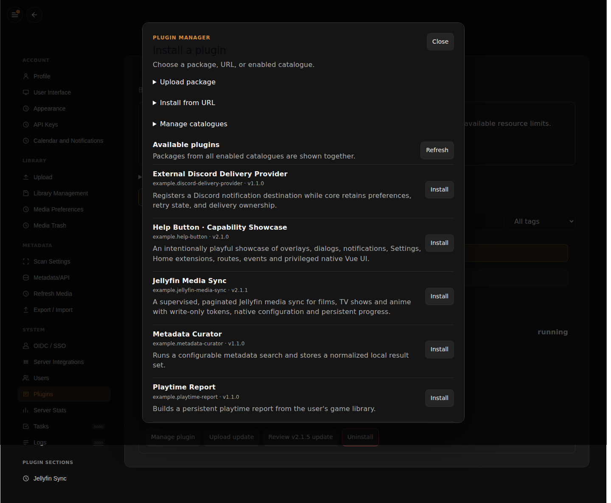

Choose upload, URL or catalogue. The catalogue entries come from live host replies.

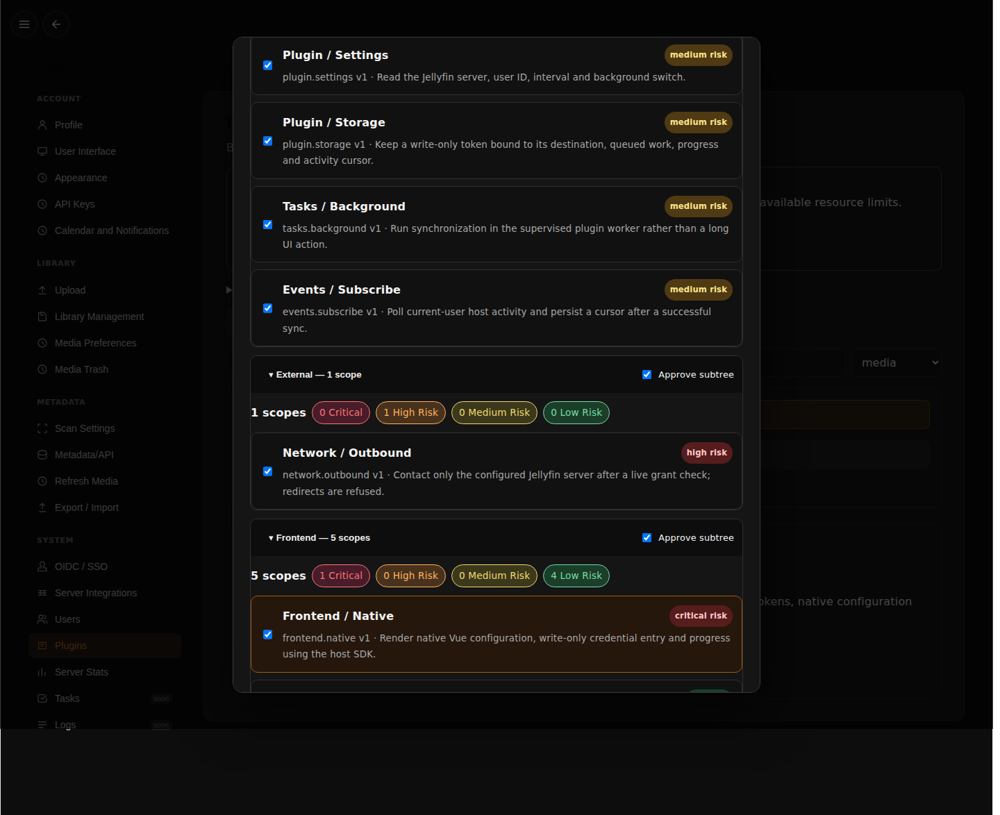

The test selects reviewed scopes in the disposable deployment. The host owns
the group counts and risk classifications; a signature does not approve a grant.
Developers should request only the authority their feature needs.

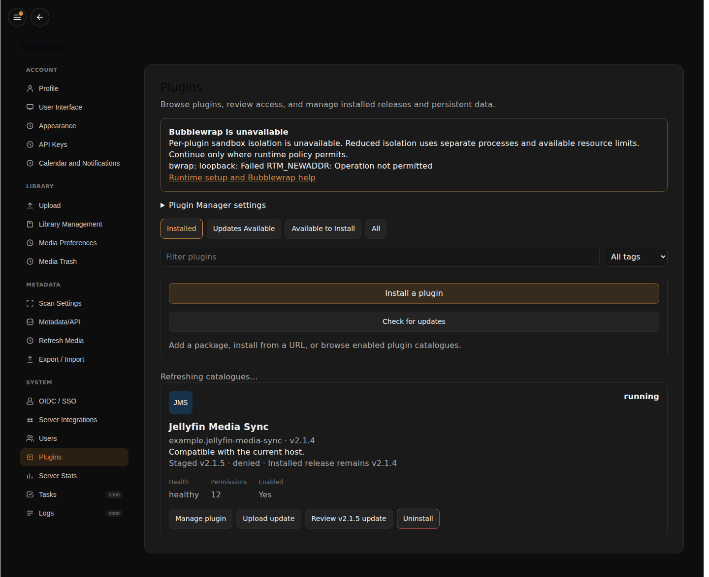

The new `games.read` scope was explicitly denied through authenticated HTTP.
The installed predecessor remains running, enabled and healthy with unchanged
grants/history. Catalogue refresh is independent of installed inventory.

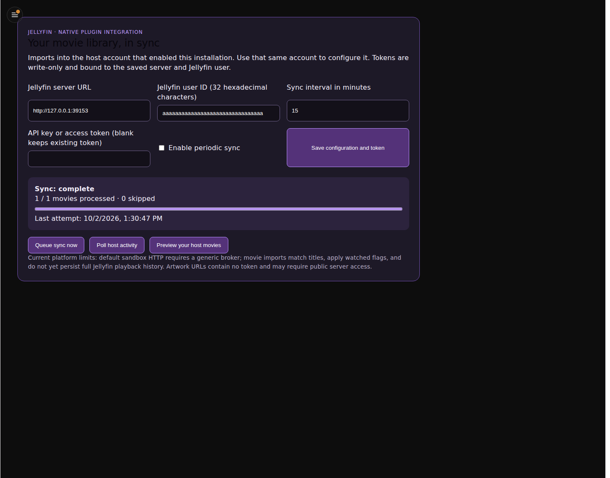

The form loads the saved disposable server/user configuration through a real
plugin action. Sync completed for one fixture movie. The saved token is never
returned to the password input. No secret or real user data appears here.

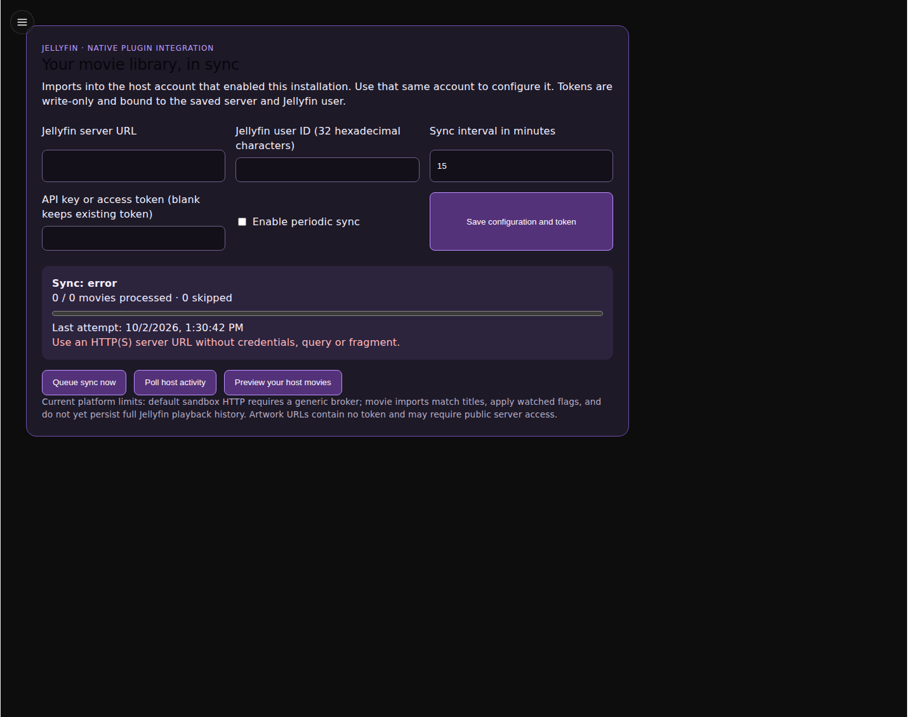

This earlier view shows the native actions/progress surface and the expected
validation error for an empty server URL, before successful configuration.

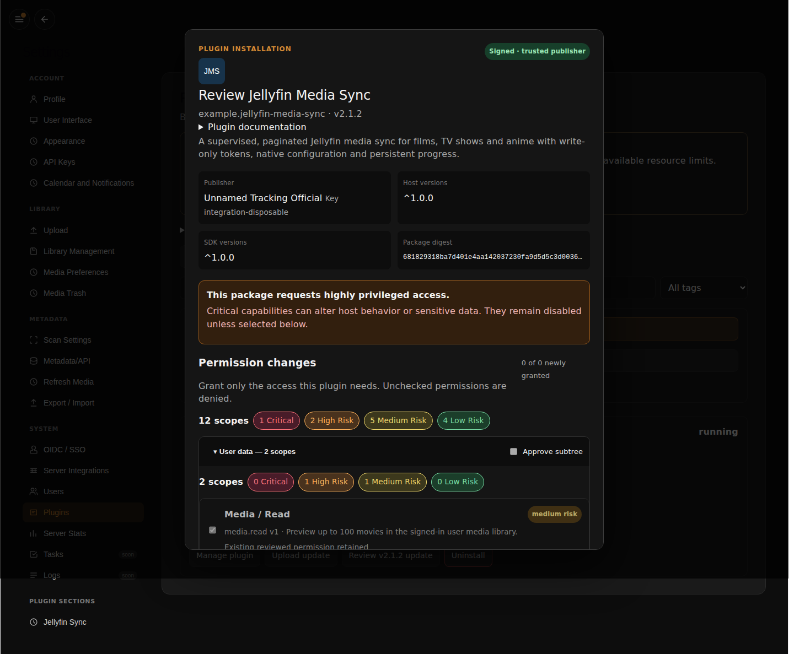

Review signer, compatibility, digest and permission changes before activation.
This ordinary update retains previously reviewed grants. The later introduced
scope is tested separately by staging, denial and explicit approval.


Stop, disable, retaining reinstall, reinstall with purge and uninstall with purge
are separate controls. The screenshot is taken while the predecessor is healthy;
the acceptance suite executes the preservation/deletion checks separately.

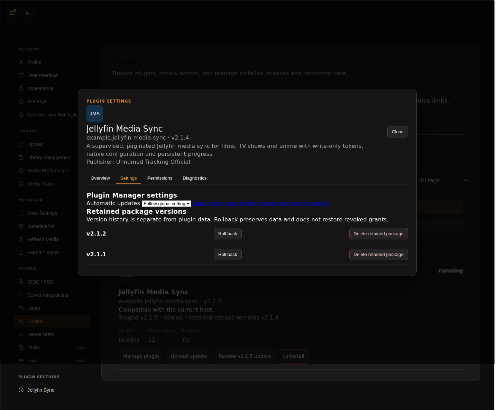

The retained predecessors are real packages. Rollback preserves live data, and
does not restore revoked grants. Deleting a retained package is a different action.

## Installer, installed state and lifecycle controls

The views below were captured on 2 October 2026 from host revision
`5af8f17dcdda41b8242953f46ef87d46febb1f03`. They compile and render actual
`PluginManagerSection`, `PluginSettingsDialog` and `PluginUiHost` Vue source.
The UI/catalogue inputs come from UI/API v1.1.0 at plugin revision
`82b5ee01d81de39f30c94e152ac6e11480c3816c`. API status, grants and retained history
are fixture replies. These document controls/layout, **not** authenticated
installation, isolation or lifecycle enforcement.

The [capture manifest](host-components.json) records timestamp, revisions, purpose
and SHA-256 for each unchanged PNG. The documentation checker verifies the bytes.


Choose upload, URL or catalogue. This capture stops before package review.


The installed card shows version, health, permission count and management entry.
Its running state is seeded for this preview.


Display mode and Read library come from the maintained declarative document.
No setting is saved or action executed. The authenticated Jellyfin capture below
demonstrates a separate write-only token form.

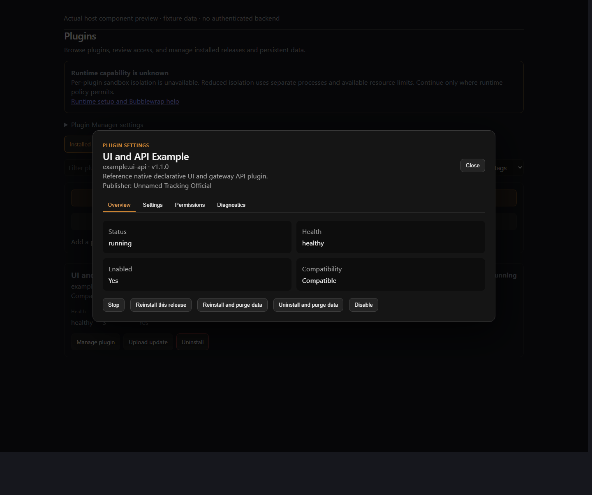

Stop/disable, retaining reinstall, purge and uninstall are distinct controls.
No lifecycle operation is clicked during capture.


Rollback and deletion of a retained package are separate from data restoration.
The retained version here is a fixture rather than an actual installation history.

## Authenticated host and existing plugin captures


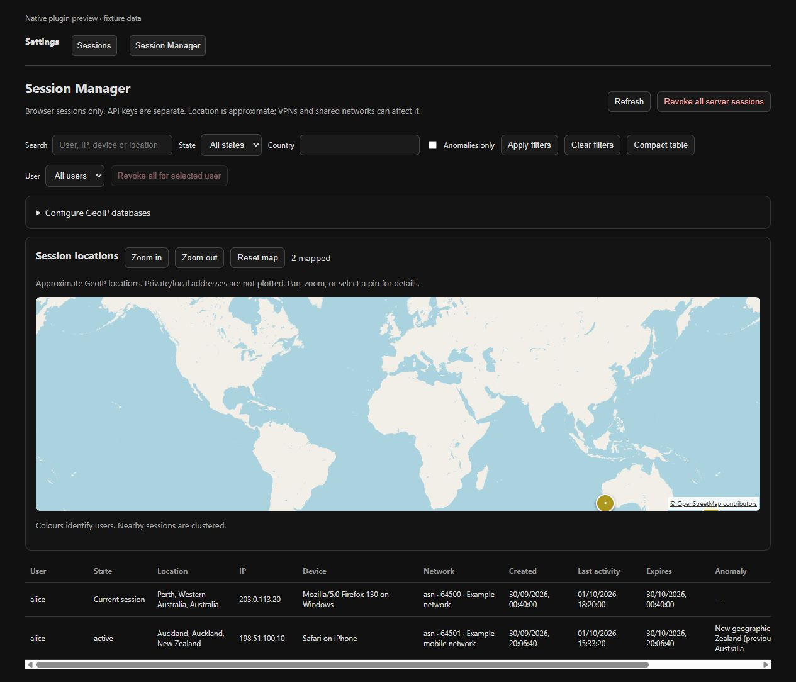


## Capture live Plugin Manager workflows

The existing host acceptance runs the **real built host frontend** against its
disposable PostgreSQL/HTTP/runtime deployment. Its Playwright script saves
`permission-review.png`, `jellyfin-native-ui.png` (settings/plugin UI) and
`update-review.png` (release/permission details) to the work directory. The CI job
uploads them as `plugin-manager-integration-evidence`, including failure captures
and logs. Download successful captures, verify they match the reviewed host build,
then add them here with revision/date/workflow provenance.

The plugin repository's `check_host_lifecycle.py` adapter also captures installer,
installed state, loaded native configuration, lifecycle controls and retained
history through `capture_host_workflow.mjs`. It passes the live disposable session
through a private temporary cookie file, deletes it immediately, and writes only
PNG/hash/revision provenance to `workflow-captures.json`. No API response is mocked.

For a reproducible local run follow [testing](../../testing/index.md), including
the host prerequisites, and pass `--browser`. Do not construct a lookalike
Plugin Manager UI or label unit fixture output as an installation screenshot.
The captures above were imported from a successful job and visually inspected.
They remain dated evidence; refresh them from a successful run when the host UI changes.

To reproduce component previews on Windows or Linux, install this repository's
locked browser dependencies and Chromium plus the host's frontend dependencies:

```sh
node tools/capture_host_components.mjs .validation/host .validation/host-component-captures
```

Review and copy PNGs and the generated manifest together when refreshing docs.
Keep authenticated captures and component fixture captures separately named.

## Jellyfin 3.0 fixture captures

Captured from the installed package with disposable HTTP fixture data during the paired capability PR verification. These images do not establish live-server acceptance.

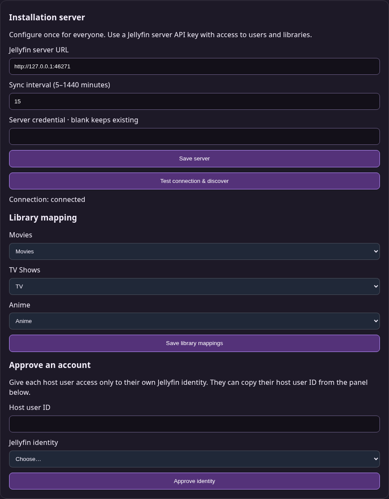

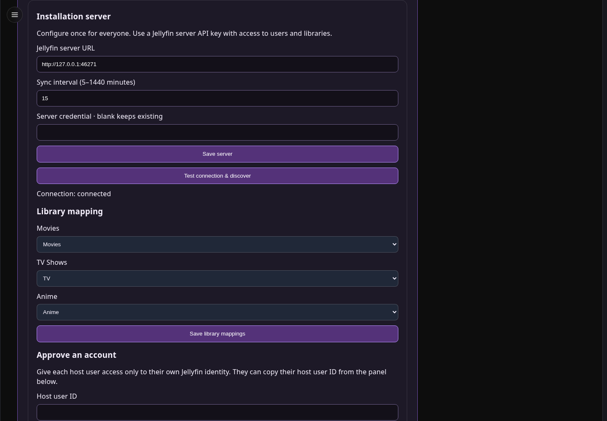

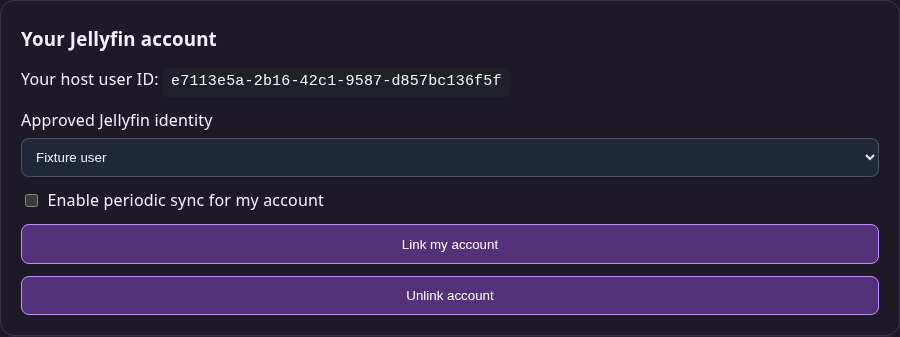

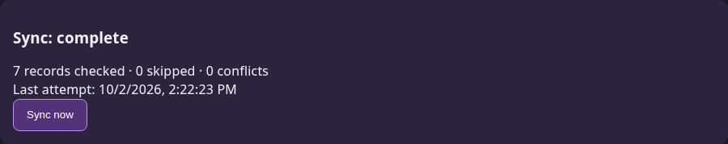

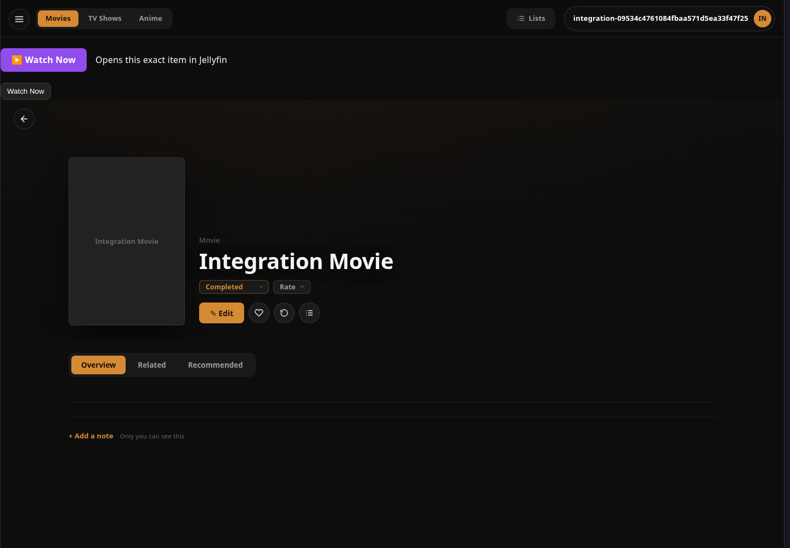
